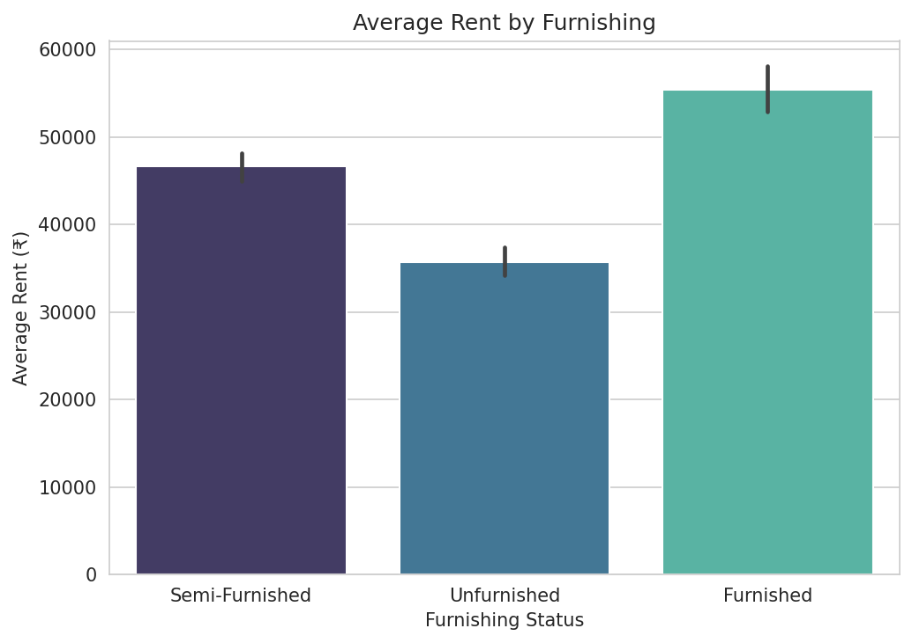
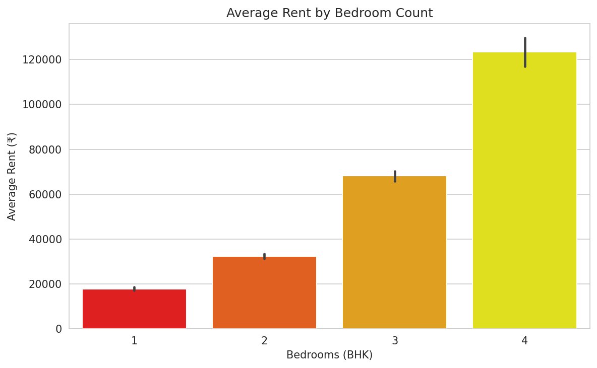
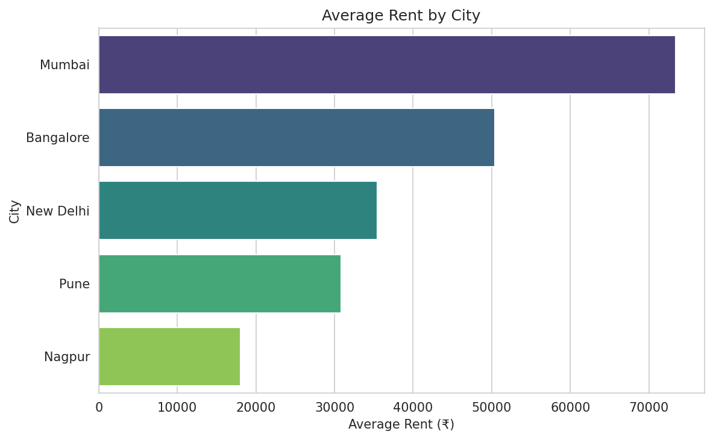

# 🏠 RentRadar — Indian Rental Market Intelligence

**Predict a fair rent for any Indian flat, and instantly tell whether a listing is a good deal or overpriced.**

RentRadar is an end-to-end data product built on ~7,500 real rental listings across five Indian cities. It cleans messy listing data, uncovers what actually drives rent through statistical testing, trains a machine-learning model to predict fair prices, and serves it all through an interactive web app.

<!-- TODO: replace with your live app link once deployed -->
**🔗 [Try the live app](https://rent-radar.streamlit.app/)** &nbsp;·&nbsp; **📊 [See the findings](#key-findings)** &nbsp;·&nbsp; **🧠 [How it works](#how-it-works)**

<!-- TODO: add a screenshot or GIF of the app here once deployed -->
<!--  -->

---

## What it does

A renter looking at a flat asks two questions: *"What should this cost?"* and *"Am I getting ripped off?"* RentRadar answers both.

- **Estimates fair rent** for any flat from its city, locality, size, bedrooms, bathrooms, and furnishing.
- **Flags the deal** — enter what a listing is asking, and RentRadar labels it **Good Deal**, **Fairly Priced**, or **Overpriced**, with the percentage difference from fair value.

---

## Key findings

Before modeling, I explored the data and **statistically tested** what drives rent. All three findings are significant at p < 0.05.

**1. Furnished flats command a real premium.**
Furnished flats rent for roughly **₹19,700 more per month** than unfurnished ones. A Welch's t-test confirmed the gap is significant (t = 12.56, p ≈ 3×10⁻³⁵) — not random noise.



**2. Rent rises sharply with bedroom count.**
Average rent roughly doubles with each bedroom from 1 to 4 BHK. One-way ANOVA confirmed the differences are significant (F = 1341, p ≈ 0). Higher BHK categories (5+) were excluded due to too few samples.



**3. Cities differ dramatically.**
Mumbai is the most expensive (~₹73,000 average), Nagpur the cheapest (~₹18,000) — a ~4× spread. ANOVA confirmed the city effect is significant (F = 285, p ≈ 6×10⁻²²⁹).



**Which groups differ?** A one-way ANOVA only says *at least one* group stands out. Post-hoc **Tukey HSD** (which corrects for multiple comparisons) shows the differences are pervasive, not driven by a single outlier: **all 10 city pairs** differ significantly — even the closest, New Delhi vs Pune — and **all 6 bedroom pairs (1–4 BHK)** differ significantly. No two cities, and no two adjacent BHK levels, are statistically interchangeable.

> **Note on interpretation:** these tests establish *statistical association*, not proven causation. The bedroom and city effects partly reflect differences in flat size and location.

---

## The model

I framed fair-rent prediction as a regression problem and benchmarked every model against a deliberately simple baseline.

| Model | RMSE (avg error) | vs. baseline |
|---|---|---|
| Baseline (locality average) | ₹41,434 | — |
| Linear Regression | ₹30,407 | better |
| **Random Forest** | **₹29,180** | **30% better** |

The **Random Forest beat the naive baseline by 30%**, capturing nonlinear relationships and feature interactions that a locality average alone misses.

**Honest limitations:** the model's error is largest on ultra-luxury rentals (₹1 lakh+), which are sparse in the data — so very high-end flats are predicted less reliably. Locality sparsity was the other big issue: over 1,000 localities appeared only once. I bucketed every locality with fewer than 10 listings — counted on the training split only, to avoid leakage — into a single "Other" group, cutting the feature space from **1,762 to 145 columns**. This trades a little raw accuracy (an earlier 1,762-column model scored ~₹27,800 RMSE by memorizing one-off localities) for a far more defensible model that generalizes to unseen areas.

---

## How it works

```
  Raw listings  →  Clean & validate  →  Explore & test  →  Train model  →  Serve app
   (CSV, 7.7k)      (pandas)            (scipy stats)      (scikit-learn)   (Streamlit)
```

1. **Data cleaning** — parsed messy fields, removed sale-price contamination and outliers, handled missing values. (See `DATA_QUALITY.md` for every decision.)
2. **Statistical analysis** — t-tests and ANOVA to identify significant rent drivers.
3. **Modeling** — train/test split, locality-average baseline, then Linear Regression and Random Forest, compared on held-out data via RMSE.
4. **Deployment** — a Streamlit app that loads the trained model and returns a fair-rent estimate plus a deal verdict.

---

## Tech stack

**Python** · **pandas** · **scikit-learn** · **scipy** · **matplotlib / seaborn** · **Streamlit** · **joblib**

---

## Data quality

A core part of this project was handling real, messy data honestly. The original `price` column was contaminated with sale prices and junk values; I evaluated the data, switched to a cleaner source with a labeled `rent` field, and documented every cleaning decision. Full details in [`DATA_QUALITY.md`](DATA_QUALITY.md).

---

## Run it yourself

```bash
# 1. Clone and enter the repo
git clone https://github.com/Sayan7anDa5/rentradar.git
cd rentradar

# 2. Install dependencies
pip install -r requirements.txt

# 3. Launch the app
streamlit run app.py
```

The app opens in your browser. Pick a city and locality, set the flat's details, enter an asking rent, and click **Check This Deal**.

---

## Repository structure

```
rentradar/
├── README.md
├── DATA_QUALITY.md          # every data-cleaning decision
├── requirements.txt
├── app.py                   # the Streamlit app
├── data/
│   ├── data.csv             # raw source data
│   └── rentals_clean.csv    # cleaned dataset
├── models/
│   ├── rent_model.pkl       # trained Random Forest
│   └── model_columns.pkl    # feature columns for inference
├── notebooks/
│   ├── EDA.ipynb            # exploration & cleaning
│   ├── Stats.ipynb          # statistical testing
│   └── modeling.ipynb       # model training & evaluation
└── charts/                  # exported visualizations
```

---

## What's next

- Deploy to a public URL (Streamlit Community Cloud)
- Migrate the data layer to PostgreSQL

---

**Built by Sayantan** — [LinkedIn](https://linkedin.com/in/sayantan-das-38982b27a) · [GitHub](https://github.com/Sayan7anDa5)
